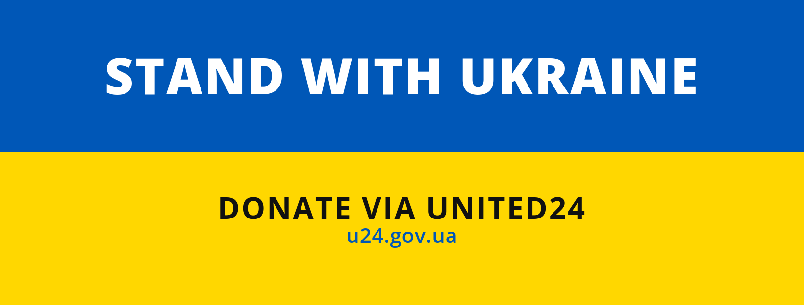
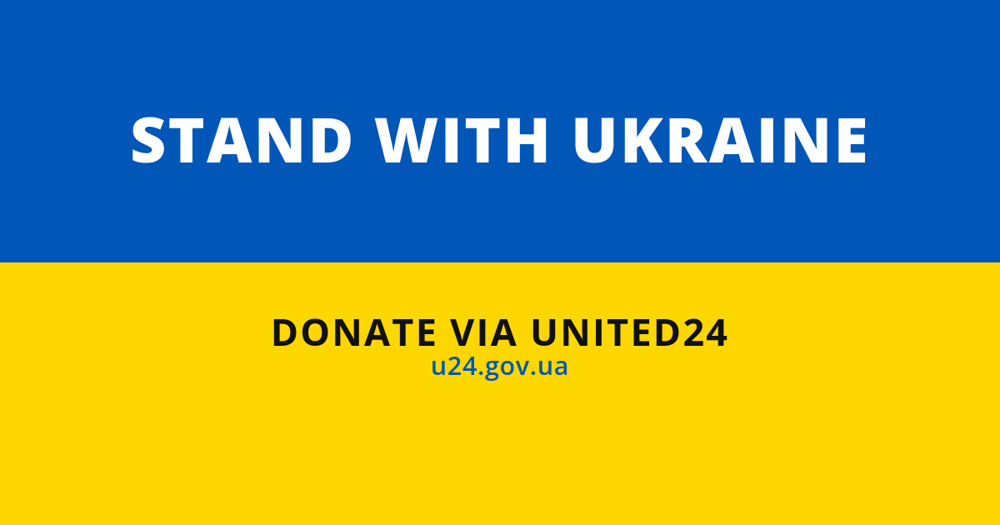
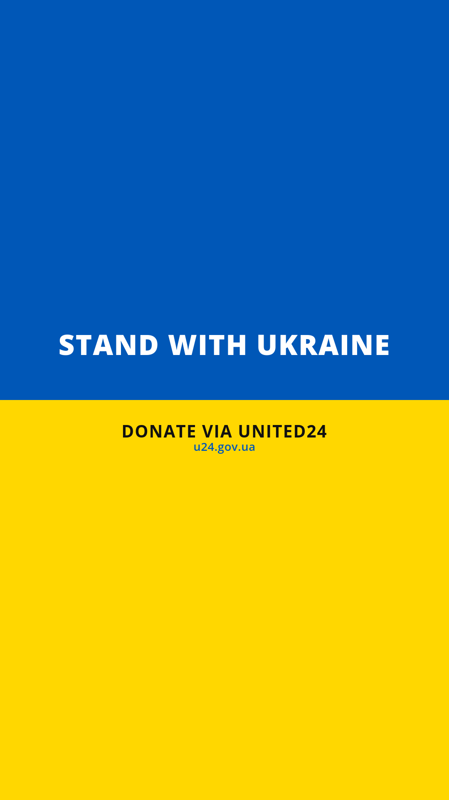
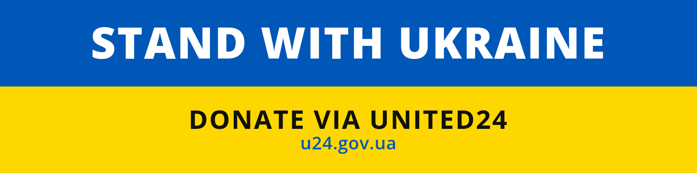

# Ukraine Support Media Assets for Social Networks

Use media assets to show your Ukraine support.

## GitHub banner (for repositories, profiles, and organizations)

[](https://standforukraine.com/)

Add a `README.md` file to your repo on your [profile](https://docs.github.com/en/account-and-profile/setting-up-and-managing-your-github-profile/customizing-your-profile/managing-your-profile-readme) or [organization](https://docs.github.com/en/organizations/collaborating-with-groups-in-organizations/customizing-your-organizations-profile).

```
[](https://standforukraine.com/)
```

## Facebook cover photo



## Instagram square post / facebook profile photo


## Instagram rectangular post / facebook profile photo


## Facebook post



## Instagram story



## Twitter header


## Linkedin cover



---

## About the maintainer

<div align="center">

**Maintained by [Vladimir Mikhalev](https://github.com/heyvaldemar)** · Docker Captain · IBM Champion · AWS Community Builder

[YouTube](https://www.youtube.com/channel/UCf85kQ0u1sYTTTyKVpxrlyQ?sub_confirmation=1) · [Blog](https://heyvaldemar.com) · [LinkedIn](https://www.linkedin.com/in/heyvaldemar/)

</div>
