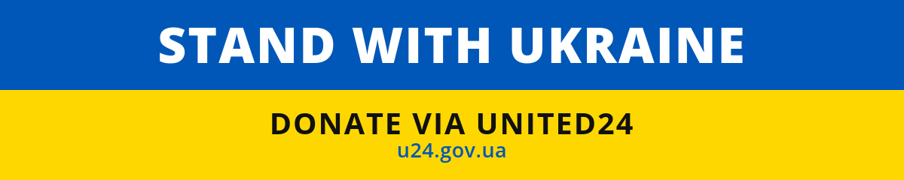

# Ukraine support assets for social networks

<a href="https://u24.gov.ua/"></a>

Every image here has the address drawn on the artwork. A LinkedIn cover is not a link, an Instagram story is not a link, and a screenshot of either is not a link, so an asset whose only call to action is a hyperlink asks for the donation in the one place the reader cannot act on it. Nine images, one destination, generated from one file.

The destination is [UNITED24](https://u24.gov.ua/), the fundraising platform of the Ukrainian government, at `u24.gov.ua`. It is a `.gov.ua` address rather than a charity's, it publishes where the money went, and it is the only address that appears anywhere in this repository.

## Use the banner

Add a `README.md` to your [profile](https://docs.github.com/en/account-and-profile/setting-up-and-managing-your-github-profile/customizing-your-profile/managing-your-profile-readme) or [organization](https://docs.github.com/en/organizations/collaborating-with-groups-in-organizations/customizing-your-organizations-profile) repository and paste this:

```markdown
[](https://u24.gov.ua/)
```

For the other platforms, download the file and upload it. Nothing here needs to be edited first.

## What is here

| File | Size | Where it goes |
| --- | --- | --- |
| [`images/github-banner.svg`](images/github-banner.svg) | 1200x240 | README banner, for a repository, profile or organization |
| [`images/github-banner.png`](images/github-banner.png) | 1200x240 | the same banner where a vector is not accepted |
| [`images/linkedin-cover.png`](images/linkedin-cover.png) | 1584x396 | LinkedIn profile cover |
| [`images/twitter-header.png`](images/twitter-header.png) | 1500x500 | X/Twitter profile header |
| [`images/facebook-cover.png`](images/facebook-cover.png) | 1640x624 | Facebook page cover |
| [`images/facebook-post.png`](images/facebook-post.png) | 1200x630 | Facebook post and general link preview |
| [`images/instagram-post.png`](images/instagram-post.png) | 1080x1080 | Instagram square post |
| [`images/instagram-post-rectangular.png`](images/instagram-post-rectangular.png) | 1080x1350 | Instagram portrait post |
| [`images/instagram-story.png`](images/instagram-story.png) | 1080x1920 | Instagram and Facebook story |

These are the sizes each platform has used for years. They are not quoted from a vendor page, and that is deliberate: those pages move, and several of the sizes this set shipped with before matched no current spec at all. The cover was 820x360 and the LinkedIn cover was 1584x396, nine pixels short of the ratio LinkedIn actually crops to.

What the sizes are not is a guarantee against cropping. Every one of these platforms crops somewhere on some device. The headline is held to 74 percent of the frame and the whole message sits on the centre line for that reason: it survives a crop that a full-bleed layout would lose.

## The pictures

### GitHub banner



### LinkedIn cover


### X/Twitter header


### Facebook cover


### Facebook post


### Instagram square post


### Instagram portrait post


### Instagram story


## Colour and contrast

The two colours are the flag's. Nothing else is added to them, and the split is exactly half, because a national flag is not a layout device.

| Text | Ground | Ratio | Passes |
| --- | --- | --- | --- |
| `#FFFFFF` headline | `#0057B7` | 6.89:1 | WCAG AA, any size |
| `#111111` call to action | `#FFD700` | 13.46:1 | WCAG AA, any size |
| `#0057B7` address | `#FFD700` | 4.91:1 | WCAG AA, any size |

Those ratios are recomputed from the colours by [`tools/contrast.py`](tools/contrast.py) on every CI run. A stated accessibility number that nothing recomputes outlives the colour it described.

## How these are made

[`tools/build-assets.py`](tools/build-assets.py) draws all eight vector sources into `src/`. [`tools/render.sh`](tools/render.sh) turns each into the PNG under `images/` and publishes the banner's vector beside it. `src/` is what a person edits. `images/` is what the script produces, and nothing is both.

The renderer is a Chromium pinned by digest inside a container, not whatever browser is installed on the machine running it. Two people, or a person and CI, get identical pixels only that way. It also removes a trap that costs an afternoon to find: that container has no Helvetica and no Arial, and asking for either yields WenQuanYi Zen Hei, a Chinese face that also covers Latin. It substitutes silently, at different widths, and the image still renders. Every line of type here is placed by arithmetic over advance widths measured inside that exact container, and [`tests/render-metrics.sh`](tests/render-metrics.sh) re-measures them on every run, because numbers that quietly stopped being true would push text off the edge of an image CI had already called green.

To change the wording, the colours or the destination, edit the constants at the top of `tools/build-assets.py`, then:

```bash
python3 tools/build-assets.py && tools/render.sh && tests/assets-are-what-they-claim.sh
```

Docker is required for the render. Nothing else is: the tools use only the Python standard library, and `tools/png-size.py` and `tools/png-ink.py` read PNGs directly rather than asking for Pillow or ImageMagick, because a dependency that has to be installed is the one that will be missing on the machine where it matters.

## What CI checks

[`tests/assets-are-what-they-claim.sh`](tests/assets-are-what-they-claim.sh) runs on every push and pull request. It decodes each published PNG and checks that its dimensions are the ones this README states, that the flag's blue and yellow each cover their half, and that white and dark ink are actually present, because a render that failed silently is still a valid PNG of the right size and only what is drawn on it tells the two apart. It checks that every colour in every source is one of the four declared here, that no source reaches outside itself for a font or an image, that the published files are what the generator produces, and that the table above lists every file that exists and no file that does not.

It also checks that one address appears in this repository and that it is `u24.gov.ua`. That check exists because of what it found: the set this replaced sent the banner to one third-party domain and the README link beside it to a different one, and nothing in the repository could have noticed.

## Licence

[MIT](LICENSE). Use them, change them, no attribution needed.

---

## About the maintainer

<div align="center">

**Maintained by [Vladimir Mikhalev](https://github.com/heyvaldemar)** · Docker Captain · IBM Champion · AWS Community Builder

[YouTube](https://www.youtube.com/channel/UCf85kQ0u1sYTTTyKVpxrlyQ?sub_confirmation=1) · [Blog](https://heyvaldemar.com) · [LinkedIn](https://www.linkedin.com/in/heyvaldemar/)

</div>
